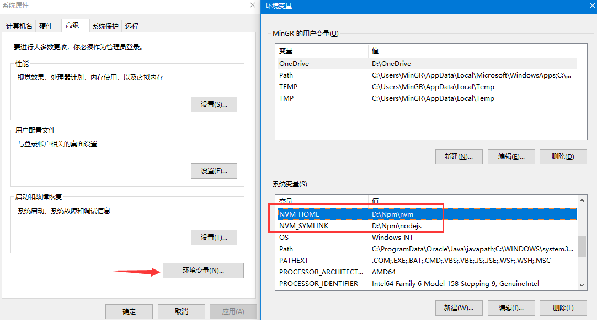
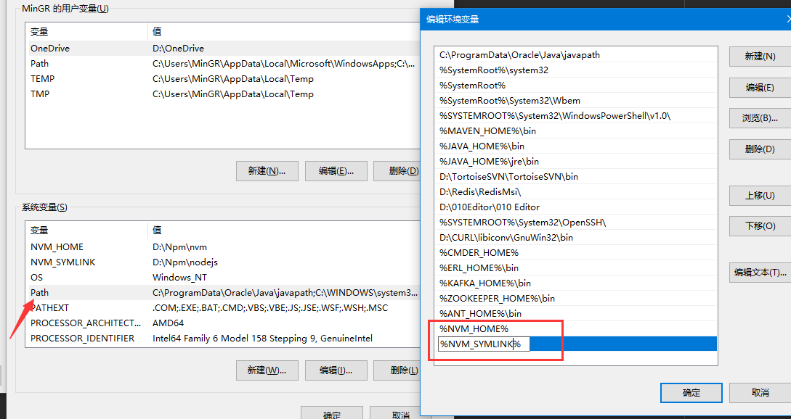

# nvm是什么

Node版本的迭代速度很快，版本很多，不同项目对 node的依赖不同，故需要切换不同 node 版本
  
目前有n和nvm这两个工具可以对Node进行无痛升级，n 命令是作为一个 node 的模块而存在，而 nvm 是一个独立于 node/npm 的外部 shell 脚本，因此 nvm 命令相比 n 更加全面，n更有局限性。

nvm 是 Mac 下的 node 管理工具，有点类似管理 Ruby 的 rvm，如果是需要管理 Windows 下的 node，官方推荐是使用 `nvmw` 或 `nvm-windows`。

# 下载

`nvm-windows` 可以在 github 中进行下载。下载地址：[download-nvm-windows](https://github.com/coreybutler/nvm-windows/releases)
  

 
选择第一个 `nvm-noinstall.zip`，然后解压在系统盘（建议放D盘）。笔者存放的目录路径是 `D:\Npm\nvm`，解压出来的文件有：

```
├─elevate.cmd
├─elevate.vbs
├─install.cmd
├─LICENSE
└─nvm.exe
```
 
> **注意：** windows下要设置显示文件类型的扩展名，这样才能看到上述文件的后缀

# 安装

双击 `install.cmd`，是以控制台形式显示的，第一下直接按回车，然后会在 D盘 根目录产生 `settings.txt`，把这个文件放进刚刚解压的那个目录
（即：`D:\Npm\nvm`），然后修改settings.txt内容，改成如下：
 
```
root: D:\Npm\nvm
path: D:\Npm\nodejs
arch: 64
proxy: none
```
 
倘若上面方法行不通，因为打开 `install.cmd` 按下回车后，显示拒绝访问注册表路径，并弹出一个 `settings.txt`。此时只需要淡定的关掉控制台及文本，
看当前盘根目录是否产生一个 `settings.txt`。将改文件直接拷贝进入 `D:\Npm\nvm` 目录里或 直接在`D:\Npm\nvm` 新建一个文件 `settings.txt`，
然后复制上面的内容即可。

- **settings 文件说明：**

```
root: nvm的存放地址
path: 存放指向node版本的快捷方式，使用nvm的过程中会自动生成。一般写的时候与nvm同级。
arch: 电脑系统是64位就写64,32位就写32
proxy: 代理
```

# 环境变量配置

以控制台方法执行成功的，在环境变量里会自动配置了 `NVM_HOME` 和 `NVM_SYMLINK` 。

如果是直接创建 `settings` 文件的可以在环境变量里创建 `NVM_HOME` 和 `NVM_SYMLINK`，并添加路径。

若环境变量配置有问题，可以直接按下面两种方式来手动配置：

右键单击 `我的电脑` - `属性` - `高级系统设置` - `高级` - `环境变量` - `系统变量` 中新建，输入对应变量名，变量值即可
 
```
NVM_HOME: D:\NodeNVM\nvm
NVM_SYMLINK: D:\NodeNVM\nodejs
```



然后还是在系统变量中找到 `Path` 变量，双击进行编辑，在变量中新建变量

`;%NVM_HOME%;%NVM_SYMLINK%;`。



# 基本操作

打开cmd窗口输入命令：`nvm -v` ，查看当前nvm的版本信息。
 
```
$ nvm -v

Running version 1.1.6.

Usage:

  nvm arch                     : Show if node is running in 32 or 64 bit mode.
  nvm install <version> [arch] : The version can be a node.js version or "latest" for the latest stable version.
                                 Optionally specify whether to install the 32 or 64 bit version (defaults to system arch).
                                 Set [arch] to "all" to install 32 AND 64 bit versions.
                                 Add --insecure to the end of this command to bypass SSL validation of the remote download server.
  nvm list [available]         : List the node.js installations. Type "available" at the end to see what can be installed. Aliased as ls.
  nvm on                       : Enable node.js version management.
  nvm off                      : Disable node.js version management.
  nvm proxy [url]              : Set a proxy to use for downloads. Leave [url] blank to see the current proxy.
                                 Set [url] to "none" to remove the proxy.
  nvm node_mirror [url]        : Set the node mirror. Defaults to https://nodejs.org/dist/. Leave [url] blank to use default url.
  nvm npm_mirror [url]         : Set the npm mirror. Defaults to https://github.com/npm/npm/archive/. Leave [url] blank to default url.
  nvm uninstall <version>      : The version must be a specific version.
  nvm use [version] [arch]     : Switch to use the specified version. Optionally specify 32/64bit architecture.
                                 nvm use <arch> will continue using the selected version, but switch to 32/64 bit mode.
  nvm root [path]              : Set the directory where nvm should store different versions of node.js.
                                 If <path> is not set, the current root will be displayed.
  nvm version                  : Displays the current running version of nvm for Windows. Aliased as v.
```

如果没有任何输出，可能的原因是变量没有生效。你需要进行关机重启再次进行验证。

你可以同样进行验证 `npm` 和 `node`：

```
$ npm -v
6.1.0

$ node -v
v10.3.0
```

另外，你也可以通过 nvm 进行安装指定的 node 版本，如下所示：
 
```
nvm install latest     // 下载最新的 node 版本 v7.2.0
nvm install 8.5.0      // 安装指定 node 版本
nvm install 6.11.3 32  // 安装指定 node 版本，并指定32位操作系统。默认是64位，32位需指定
```

> **[warning] 注意**
>
> 如果你的电脑系统是32 位的，那么在下载 `nodejs` 版本的时候，一定要指明 32 如： `nvm install 5.11.0 32`  这样在32位的电脑系统中，才可以使
> 用，默认是64位的。

<!--sec data-title="查看已安装的 node 版本" data-id="section0" data-show=true ces-->
**注意：** `*` 表示当前使用版本
```
$ nvm ls

  * 10.3.0 (Currently using 64-bit executable)
    8.11.2
```
<!--endsec-->

<!--sec data-title="引入使用 node 版本" data-id="section1" data-show=true ces-->
```
$ nvm use 8.11.2
Now using node v8.11.2 (64-bit)

```

验证是否已切换至 8.11.2 版本

```
$ nvm ls

    10.3.0
  * 8.11.2 (Currently using 64-bit executable)
```
<!--endsec-->

<!--sec data-title="卸载对应 node 的版本" data-id="section2" data-show=true ces-->
```
$ nvm uninstall 10.3.0
Uninstalling node v10.3.0...Error removing node v10.3.0
Manually remove D:\Npm\nvm\v10.3.0.
```
<!--endsec-->

<!--sec data-title="列出远程服务器上所有的 node 可用版本" data-id="section3" data-show=true ces-->
```
$ nvm ls available

|   CURRENT    |     LTS      |  OLD STABLE  | OLD UNSTABLE |
|--------------|--------------|--------------|--------------|
|   11.10.0    |   10.15.1    |   0.12.18    |   0.11.16    |
|    11.9.0    |   10.15.0    |   0.12.17    |   0.11.15    |
|    11.8.0    |   10.14.2    |   0.12.16    |   0.11.14    |
|    11.7.0    |   10.14.1    |   0.12.15    |   0.11.13    |
|    11.6.0    |   10.14.0    |   0.12.14    |   0.11.12    |
|    11.5.0    |   10.13.0    |   0.12.13    |   0.11.11    |
|    11.4.0    |    8.15.0    |   0.12.12    |   0.11.10    |
|    11.3.0    |    8.14.1    |   0.12.11    |    0.11.9    |
|    11.2.0    |    8.14.0    |   0.12.10    |    0.11.8    |
|    11.1.0    |    8.13.0    |    0.12.9    |    0.11.7    |
|    11.0.0    |    8.12.0    |    0.12.8    |    0.11.6    |
|   10.12.0    |    8.11.4    |    0.12.7    |    0.11.5    |
|   10.11.0    |    8.11.3    |    0.12.6    |    0.11.4    |
|   10.10.0    |    8.11.2    |    0.12.5    |    0.11.3    |
|    10.9.0    |    8.11.1    |    0.12.4    |    0.11.2    |
|    10.8.0    |    8.11.0    |    0.12.3    |    0.11.1    |
|    10.7.0    |    8.10.0    |    0.12.2    |    0.11.0    |
|    10.6.0    |    8.9.4     |    0.12.1    |    0.9.12    |
|    10.5.0    |    8.9.3     |    0.12.0    |    0.9.11    |
|    10.4.1    |    8.9.2     |   0.10.48    |    0.9.10    |

```

**注意：** `CURRENT` 栏指的是快照版本，拥有最新 node 特性，但不稳定。LTS 则是稳定版本，属于长期支持版本。
<!--endsec-->

<!--sec data-title="帮助命令" data-id="section4" data-show=true ces-->
在使用过程中，如果需要帮助，则可以使用 `help` 命令：

```
$ nvm --help

Running version 1.1.6.

Usage:

  nvm arch                     : Show if node is running in 32 or 64 bit mode.
  nvm install <version> [arch] : The version can be a node.js version or "latest" for the latest stable version.
                                 Optionally specify whether to install the 32 or 64 bit version (defaults to system arch).
                                 Set [arch] to "all" to install 32 AND 64 bit versions.
                                 Add --insecure to the end of this command to bypass SSL validation of the remote download server.
  nvm list [available]         : List the node.js installations. Type "available" at the end to see what can be installed. Aliased as ls.
  nvm on                       : Enable node.js version management.
  nvm off                      : Disable node.js version management.
  nvm proxy [url]              : Set a proxy to use for downloads. Leave [url] blank to see the current proxy.
                                 Set [url] to "none" to remove the proxy.
  nvm node_mirror [url]        : Set the node mirror. Defaults to https://nodejs.org/dist/. Leave [url] blank to use default url.
  nvm npm_mirror [url]         : Set the npm mirror. Defaults to https://github.com/npm/npm/archive/. Leave [url] blank to default url.
  nvm uninstall <version>      : The version must be a specific version.
  nvm use [version] [arch]     : Switch to use the specified version. Optionally specify 32/64bit architecture.
                                 nvm use <arch> will continue using the selected version, but switch to 32/64 bit mode.
  nvm root [path]              : Set the directory where nvm should store different versions of node.js.
                                 If <path> is not set, the current root will be displayed.
  nvm version                  : Displays the current running version of nvm for Windows. Aliased as v.
```
<!--endsec-->

# 使用 cnpm

使用 npm 命令直接下载安装是需要使用国外的网站。有时会很慢，阿里针对此做了专属镜像 `cnpm`。使用镜像进行下载安装会更加快速，当前 `cnpm` 同步频率
目前为 10分钟 一次以保证尽量与官方服务同步。要想使用 `cnpm` 只需要执行以下命令即可：

```
$ npm install -g cnpm --registry=https://registry.npm.taobao.org
```

完成安装后你就可以使用 `cnpm` 进行代替 `npm` 了。

<!--sec data-title="镜像加速" data-id="section5" data-show=true ces-->
在基本操作中，有说明 `nvm` 的基本使用，比如安装使用  `nvm install <node-version>`。正常而言，是能成功下载的。不过有时候网络波动问题等，会
导致无法下载或下载失败等问题。比如：`node` 下载成功了但是 `npm` 却下载失败。其中主要的原因就是网络影响的。

想要解决该问题，我们可以使用镜像进行下载。阿里对此作了镜像，我们可以免费使用。只需要在 `nvm` 的 `settings.txt` 文件中增加如下两句配置即可：

```
node_mirror: https://npm.taobao.org/mirrors/node/
npm_mirror: https://npm.taobao.org/mirrors/npm/
```

这样就能使用镜像加速下载 `node` 和 `npm` 了。完整 `settings.txt` 如下：

```
root: D:\Npm\nvm
path: D:\Npm\nodejs
arch: 64
proxy: none
node_mirror: https://npm.taobao.org/mirrors/node/
npm_mirror: https://npm.taobao.org/mirrors/npm/
```

<!--endsec-->

# 扩展说明

关于 node 的升级卸载问题，不同于官网 node 的安装。

使用 nvm 后你完成可以使用它进行管理。比如，当前使用 node 版本是 `v10.15.0` 你想要升级到最新版本，只需要执行 `nvm install latest` 进行安装。
安装完成后直接使用 `nvm use <node-version>` 即可，这样就达到了无缝升级。

所以，nvm 是推荐的 node 安装方式！！！！